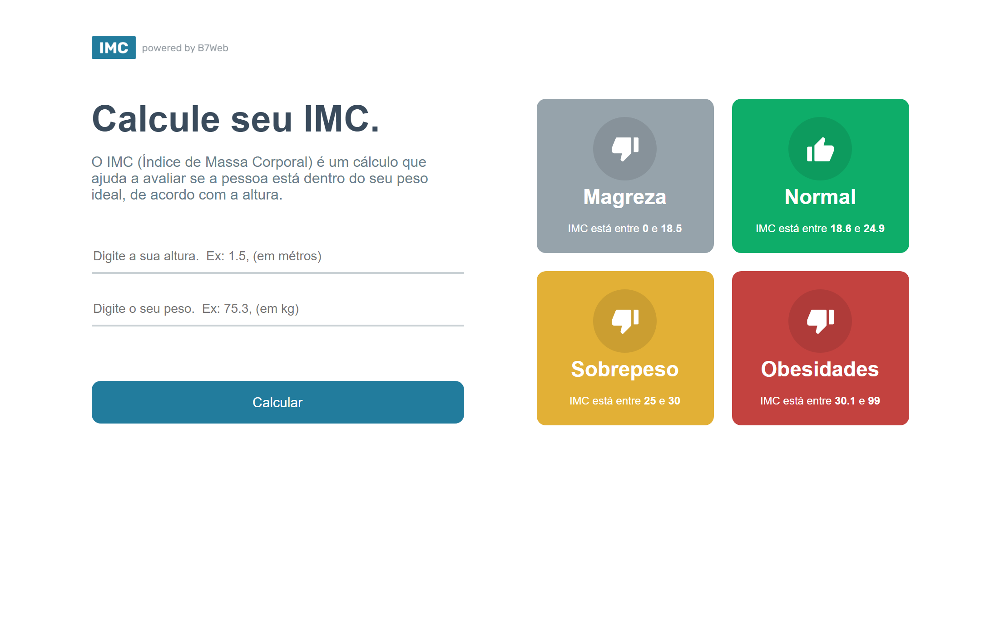

# Calculadora de IMC
> site para estudo de React e TypeScript

Projeto construído como exercício do curso da B7web

> finalizado, porem com pretenções de aprimoramento

## Tecnologias:

- HTML
- CSS
- Git e Github
- typeScript
- React
